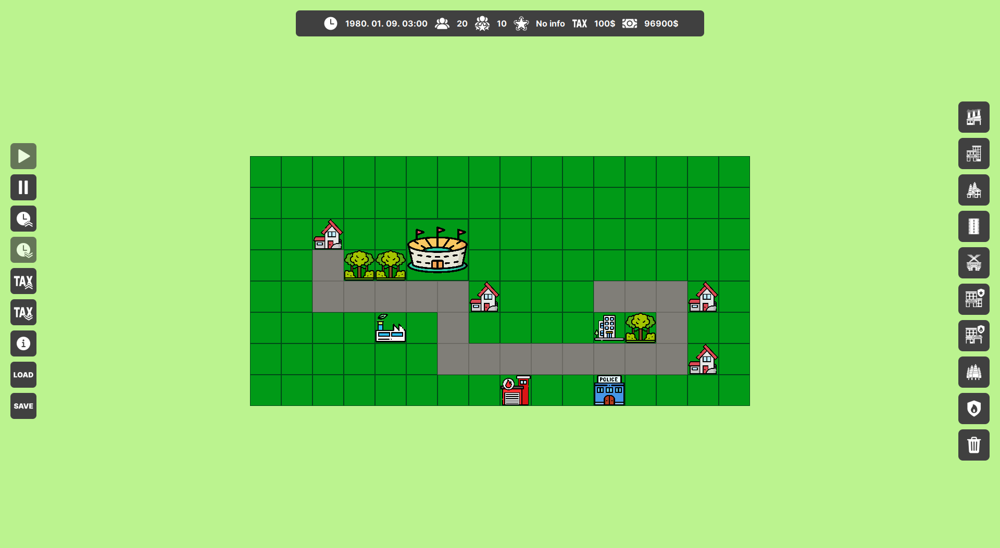

# UrbanTycoon
## Játék rövid leírása
A játékban, a játékosnak fel kell építenie saját városát és menedzselnie azt egy széles jogkörökkel bíró polgármesterként. A város különböző típusú zónákból (amelyeken a lakók
automatikusan építkeznek), a játékos által külön megépítendő kiszolgáló épületekből és az ezeket
összekötő utakból áll. A játékos célja, hogy **virágzó város**t fejlesszen, ahol a **polgárok boldogok** és a
**költségvetés kiegyensúlyozott**.
A kezdeti városépítésére a játékos kap egy kezdőtőkét, azonban a további fejlesztésekhez a helyi
adóbevételekre kell támaszkodnia. A játékosnak az építésen, romboláson kívül lehetősége van az alábbi funkciókra is:
- Idő gyorsítása / lassítása / megállítása
- Adó növelése / csökkentése
- Zóna információ lekérése
- Költségvetés áttekintése

## Mezők
A játéktér különböző típusú mezőkből épül fel. Ezek a mezők lehetnek **zónák**, **kiszolgáló épületek**, **utak** vagy **erdők**.
### Zóna mezők
- **Lakó zóna**: A városba költöző emberek ezen mezőkön építtethetnek házat maguknak. Minden
polgár lakik valahol, az egyes lakóövezeti mezők befogadóképessége pedig véges.
- **Szolgáltatás zóna**: A polgároknak lehetősége van ilyen típusú zónán dolgozni. Befogadóképessége véges.
- **Ipari zóna**: A polgároknak lehetősége van ilyen típusú zónán is dolgozni. Az ipari zónán nagyobb valószínűséggel üthet ki tűz, valamint a közelben lakó polgárok is kevésbé elégedettek. Befogadóképessége szintén véges.
### Kiszolgáló épület mezők
- **Rendőrség**: Környezetében egy adott sugaron belüli mezők vonatkozásában garantálja a
közbiztonságot.
- **Tűzoltóság**: Környezetében egy adott sugaron belüli mezők vonatkozásában csökkenti a tűzesetek valószínűségét. A ténylegesen kialakuló tűzesetek eloltására lehetőség nyílik. A
legközelebbi tűzoltóságról tűzoltókat lehet küldeni a helyszínre. Egy tűzoltóság egy tűzoltófecskendővel rendelkezik. Amennyiben egy tűz nem kerül időben eloltásra, egy idő után a szomszédos épületekere is átterjed, tovább várakozva az épület megsemmisül.
- **Stadion**: Környezetében egy adott sugaron belüli bármilyen
zóna mező vonatkozásában bónusszal növeli a polgárok elégedettségét, ha ott laknak vagy
dolgoznak.
### Egyéb mezők
- **Út**: A polgárok csak olyan zóna mezőn fognak automatikusan építkezni, amely közútról elérhető, egyéb esetben a mező hiába lett kijelölve, érdemben nem használható. Továbbá a város polgárai csak olyan munkahelyen tudnak munkát vállalni, amely a lakóhelyükről közúton elérhető.
- **Erdő**: Javítja azon közelben
lakók elégedettségét, akik közvetlenül rálátnak, és növelik a beköltözési kedvet is ilyen zónákba. Csökkenti az ipari zónák által a lakózónákra kifejtett
negatív hatást, ha két ilyen mező között helyezkedik el. Az erdők 10 éven át növekednek, míg elérik kifejlett állapotukat. Ennek megfelelően az ültetésük
utáni első 10 évben folyamatosan növekedjen az erdő mezők utáni bónusz.

## Népesség
A játékos feladata minél nagyobb város fejlesztése, amelyhez nagyobb népesség is szükséges. A játék
kezdeti időszakában egy adott, kisebb népesség garantáltan érkezik a városba, amennyiben van
szabad lakózóna, ezzel segítve a település elindulását. Később a további polgárok érkezését a
következő tényezők befolyásolják pozitívan:
- a városban a **polgárok általános elégedettségi szintje**
- a cél lakózónához **minél közelebbi** szabad kapacitással rendelkező **munkahely**
- a cél lakózónához **nincsen közel ipari épület**

Minden polgárnak van életkora és **65 évesen nyugdíjba vonulnak**. Ezt követően a nyugdíjas polgár már **nem
dolgozik**, de lakóhelyre továbbra is szüksége van. **Adót nem fizet**, helyette **nyugdíjat kap**, ami a
nyugdíjba menetele előtti 20 évben fizetett éves adó átlagának fele legyen.
A városba kívülről érkező új polgárok életkora 18 és 60 év közötti. A nyugdíjkorhatár felett
minden évben (egyre növekvő) valószínűséggel **elhalálozik** a nyugdíjas polgár. Ekkor automatiikusan
egy fiatal, 18 éves polgár lép a helyére, aki azonban
nem feltétlenül ugyanott fog lakni.

## Elégedettség
A város minden polgára rendelkezik egy elégedettségi mutatóval, amelyet **pozitívan** befolyásolnak a
következő tényezők:
- **alacsony adók**
- lakóhelyhez **közeli munkahely**
- lakóhelyhez **nincsen közel ipari épület**
- lakóhely és munkahely **közbiztonság**a

**Negatívan** befolyásolják az elégedettséget a következő tényezők:
- a fenti **pozitív tényezők ellentétei**
- ha a város **negatív büdzsé**vel rendelkezik (hitelből működik), ez a faktor arányos azzal,
hogy mekkora hitelről van szó és hány éve negatív a büdzsé
- ha **kiegyensúlyozatlan** a városban a **szolgáltatások és az ipari termelés aránya**

Az elégedettségi mutató polgáronként és a teljes városra is értelmezendő. A
nagyon **elégedetlen polgárok** egy idő után **elköltözhetnek** a városból. Amennyiben a teljes **város
elégedettsége kritikus**an alacsonnyá válik, leváltják a polgármestert és a **játékos vesztett**.

## Bevétel és költségek
A játékos, mint polgármester egyik legfontosabb feladata a stabil költségvetés fenntartása, hogy a
város kiadásai (hosszú távon) ne haladják meg a bevételt. Amennyiben a büdzsé negatívba fordul,
lehetőség van tovább költekezni. Ilyenkor **hitelből működik** a város, azonban ez a
polgárok egyre súlyosabb elégedetlenségéhez vezet, ami végső soron a polgármester leváltását és a
**játék elvesztését** eredményezheti. A játékos bevételt **adó**k formájában szerezhet, amelyhez egy éves fix adó összege vethető ki minden
zóna mezőre. A beszedett adó mértéke függ attól, hogy az adott zóna mezőn hányan laknak vagy
dolgoznak. A játékban lehetőség van a költségvetés (bevétel és kiadások) áttekintésére.

## Képernyőkép a játékról

## További információ
- A dokumentáció, és a kiválasztott részfeladatok a [Wiki](https://github.com/szeidlattila/urbantycoon/wiki) oldalon találhatók.
